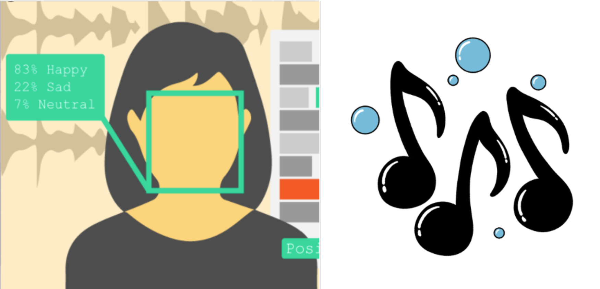
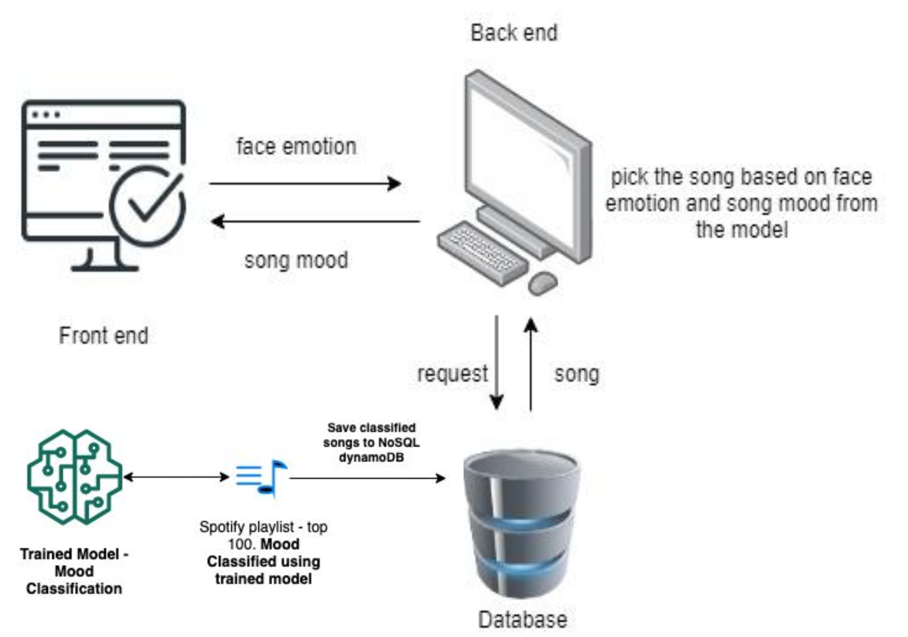
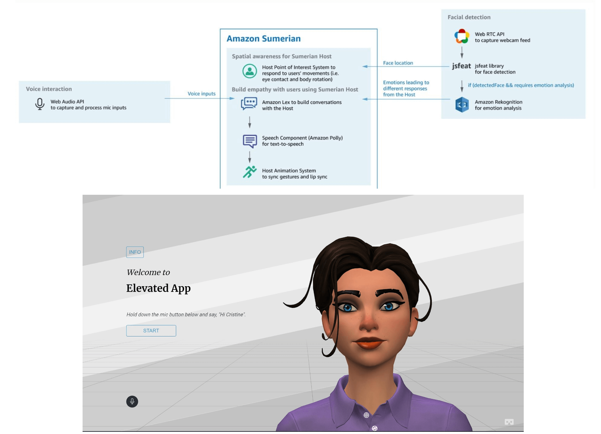

# Elevate

## Emotion recognition and play a song from playlist to uplift the mood. 

 

* Analyzing Video Stream and predicting an emotion. We will need to detect face from video stream and use amazon emotion rekognition API to determine emotion.
* Build a model that analyzes an audio file and determines the mood of a song. Classify the sample playlist of spotify songs into different moods. Store the mood of song into dynamoDB.
* Use emotion recognition response and play a song from classified playlist using predefined mapping between emotion <-> mood of the song. 

## Architecture
 

## Sumerian (front-end)
 

## Video

